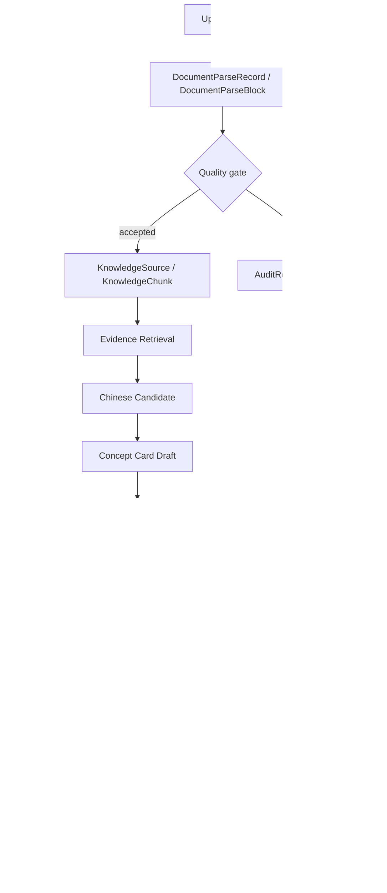

# LexiBridge-AI Architecture Map

Updated: 2026-07-16

This map describes the current implemented pilot architecture. It is not a future-state product plan.

## Core Data Objects

- `DocumentParseRecord`: per-upload parse summary with `parse_uid`, parse status, quality status, quality flags, OCR/formula indicators, warnings, and error fields.
- `DocumentParseBlock`: structured text block linked by `parse_uid` / `block_uid`, used as the governed bridge between raw files and downstream chunks.
- `KnowledgeSource`: governed source registry row with source role, trust level, license/indexing flags, visibility, quality status, and parse provenance.
- `KnowledgeChunk`: governed evidence chunk linked to `KnowledgeSource`, optionally linked to `DocumentParseBlock`, with source locator, language, trust, quality, status, and embedding status.
- `ConceptAlignmentCard`: bilingual concept object with English/Chinese terms, explanations, evidence JSON, risk labels, parse metadata, review status, and review metadata.
- `AlignmentVerificationRun`: alignment verification run record for mock/fake/replay/disabled providers. It stores structured input/output summaries, provider metadata, parser/schema versions, risk labels, status, and confidence. It is not a production approval record.
- `DocumentAlignmentWorkflowRun`: formal document-alignment workflow root added in Task 9C.4W. It represents document-level status, source identity, parse provenance, idempotency, progress, request ID, safe errors, and terminal outcomes without overloading `BackgroundJob` or legacy `AlignmentRun`.
- `DocumentAlignmentWorkflowItem`: formal document-alignment workflow item added in Task 9C.4W. It represents per-concept item key, evidence references, draft card UID, verification run UID, risk summary, retry count, and blocked/failed/needs-review state.
- `backend/services/document_alignment_workflow_application.py`: formal document-alignment admission/start service added in Task 9C.4X. It is HTTP-neutral, validates explicit governed-source/permission/admission decisions, resolves idempotency, creates `DocumentAlignmentWorkflowRun`, queues a transport-only `BackgroundJob`, writes `document_alignment_requested` audit, commits once, and rolls back persistence failures. It does not process terms, evidence, cards, verification, providers, workers, routes, or frontend state.
- Task 9C.4Y characterizes the formal processing boundary. Task 9C.4Z adds `backend/services/formal_background_job_execution.py` and additive BackgroundJob lease fields for formal jobs only: CAS claim/reclaim, a 30-second heartbeat lease, attempt/token fencing, terminal immutability, and legacy worker isolation. This is local-pilot `AT_LEAST_ONCE_TRANSPORT` plus `ATTEMPT_FENCED_OWNERSHIP`, not a formal worker or exactly-once processing. WorkflowRun and WorkflowItem remain business state; BackgroundJob remains transport-only. The next blocker is `SPLIT_TERM_EXTRACTION_AND_ITEM_PERSISTENCE_FIRST`.
- `AlignmentProviderPolicy`: governance policy for alignment providers. It records enabled state, replay/external-call gates, attach policy, human-review requirement, role/course scope, limits, and budget caps.
- `ConceptCardReviewRecord`: immutable review action record for approve, reject, revision request, more-evidence request, reopen, deprecate, assignment, and notes.
- `CourseReviewPolicy`: course-level review rules for evidence sides, blocking risks, override permissions, two-step review, and human-review requirements.
- `CourseReviewPermission`: course-scoped reviewer permission row with review/approve/override/assign flags.
- `StudentCourseMembership`: student-course membership gate for student-facing Concept Card visibility.
- `CourseStudentVisibilityPolicy`: course visibility policy for student views: `public`, `enrolled_only`, `private`, or `disabled`.
- `StudentConceptCardState`: per-user learning state for approved Concept Cards: favorite, mastered, last viewed, view count, and personal note.
- `Feedback`: legacy-compatible feedback table extended for Concept Card feedback, triage status, linked review/card IDs, handler notes, priority, and course/chapter metadata.
- `AuditRecord`: system-level audit event table with safe summaries, actor/request metadata, result/error fields, and provider/prompt/retrieval metadata.

## Core Service Modules

- Document parse quality: `services/document_parse_quality.py` creates parse records and applies quality classifications.
- Parse quality risk: `services/parse_quality_risk.py` maps parse quality into downstream risk labels and block/needs-review decisions.
- Knowledge governance: `services/knowledge_governance.py` serializes and validates governed sources/chunks/versions.
- Knowledge ingestion: `services/knowledge_ingestion.py` turns accepted parse records into governed `KnowledgeSource` and `KnowledgeChunk` rows.
- Evidence retrieval: `services/evidence_retrieval.py` performs lexical retrieval over governed chunks. It does not use embeddings, vector databases, rerankers, or external models.
- Bilingual evidence workflow: `services/bilingual_evidence_workflow.py` builds English/Chinese evidence packages and can select evidence-constrained Chinese candidates.
- Chinese term candidates: `services/chinese_term_candidates.py` extracts candidate Chinese terms from approved cards, legacy terms/cards, existing ConceptAlignmentCards, and bilingual chunks only.
- Concept Card drafts: `services/concept_card_drafts.py` creates `needs_review` draft cards from evidence. It does not auto-approve.
- Alignment verification: `services/alignment_verification.py`, `services/alignment_verification_execution.py`, `services/alignment_providers.py`, `services/alignment_prompting.py`, and `services/alignment_output_parser.py` define provider contracts, execution orchestration, prompt/schema versions, mock/fake/replay behavior, parser failure handling, usage writes, optional attach orchestration, and audit sequencing.
- Provider governance: `services/provider_governance.py` evaluates provider policy, attach rules, cost/usage limits, and human-review gates.
- Provider preflight: `services/provider_preflight.py` runs read-only readiness checks and replay dry-runs without enabling real external calls.
- Concept Card review: `services/concept_card_review.py` implements review queue, review actions, risk override handling, review history, and assignment helpers.
- Course review policy: `services/course_review_policy.py` checks course-scoped reviewer permissions and course-level review policy.
- Student course access: `services/student_course_access.py` evaluates memberships and student visibility policy.
- Student concept cards: `services/student_concept_cards.py` exposes approved-only, course-visible student card list/detail/state/feedback/export behavior.
- Student learning progress: `services/student_learning_progress.py` aggregates visible approved-card progress for the current student.
- Concept Card feedback: `services/concept_card_feedback.py` exposes teacher feedback queue and triage actions that can link back to review workflow.
- Teacher learning analytics: `services/teacher_learning_analytics.py` aggregates course/chapter/card learning metrics and exports aggregate reports.

## Route Layer

- `backend/app.py` still owns Flask app initialization, model declarations, additive migration helpers, shared response/audit/auth helpers, and most legacy route handlers.
- `backend/routes/shared.py` provides the minimal shared route foundation used by extracted route modules. Its `RouteCoreDependencies` dataclass carries only common route infrastructure: database handle, AuditRecord model/service, request ID helpers, actor/auth context helper, response helpers, and current-time helper. It does not import `backend.app`, register routes, store request-local mutable state, or include domain services.
- `backend/routes/teacher_learning_analytics.py` is the first staged route extraction. It registers:
  - `GET /api/teacher/learning-analytics`
  - `GET /api/teacher/learning-analytics/cards`
  - `GET /api/teacher/learning-analytics/export`
- `backend/routes/student_concept_cards.py` is the second staged route extraction. It registers:
  - `GET /api/student/concept-cards`
  - `GET /api/student/concept-cards/<card_uid>`
  - `POST /api/student/concept-cards/<card_uid>/state`
  - `POST /api/student/concept-cards/<card_uid>/feedback`
  - `GET /api/student/concept-cards/export`
- `backend/routes/concept_card_review.py` is the third staged route extraction. It registers:
  - `GET /api/concept-cards/review-queue`
  - `GET /api/concept-cards/<card_uid>/reviews`
  - `POST /api/concept-cards/<card_uid>/review`
  - `POST /api/concept-cards/<card_uid>/assign-reviewer`
- `backend/routes/concept_card_feedback.py` is the fourth staged route extraction. It registers the teacher-facing student feedback routes:
  - `GET /api/concept-cards/student-feedback-queue`
  - `GET /api/concept-cards/<card_uid>/student-feedback`
  - `POST /api/concept-cards/student-feedback/<feedback_uid>/triage`
- `backend/routes/provider_governance.py` is the fifth staged route extraction. It registers only read-only provider governance and preflight routes:
  - `GET /api/alignment/providers`
  - `GET /api/alignment/providers/<provider_name>/policy`
  - `GET /api/alignment/providers/<provider_name>/usage`
  - `GET /api/alignment/providers/preflight/<preflight_uid>`
  - `GET /api/alignment/providers/<provider_name>/preflight`
- `backend/routes/provider_policy.py` is the sixth staged route extraction. It registers only provider policy mutation:
  - `POST /api/alignment/providers/<provider_name>/policy`
- `backend/routes/provider_preflight.py` is the seventh staged route extraction. It registers only provider preflight execution:
  - `POST /api/alignment/providers/<provider_name>/preflight`
- `backend/routes/alignment_verification.py` is the eighth staged route extraction. It registers only the thin alignment verification HTTP adapter:
  - `POST /api/alignment/verify`
- `backend/routes/admin_alignment_runs.py` is the ninth staged route extraction. It registers only the legacy admin alignment run listing:
  - `GET /api/admin/alignment-runs`
- `backend/routes/legacy_provider_admin_observability.py` is the tenth staged route extraction. It registers only legacy provider admin observability views:
  - `GET /api/admin/ai/calls`
  - `GET /api/admin/ai/usage`
  - `GET /api/admin/ai/health`
- `backend/routes/legacy_provider_admin_configuration.py` is the eleventh staged route extraction. It registers the seed-backed legacy provider admin configuration GET views while preserving the shared prompt endpoint:
  - `GET /api/admin/ai/providers`
  - `GET /api/admin/ai/models`
  - `GET /api/admin/ai/prompts`
- `backend/routes/legacy_provider_admin_healthcheck.py` is the twelfth staged route extraction. It registers only the legacy provider admin healthcheck POST route:
  - `POST /api/admin/ai/healthcheck`
- Task 9C.4D does not extract `POST /api/alignment/verify`. It characterizes the alignment verification execution route in `docs/alignment_verification_route_boundary.md` and concludes that a service boundary is required before safe route extraction.
- Task 9C.4D.1 still does not extract `POST /api/alignment/verify`. It moves the execution orchestration into `services/alignment_verification_execution.py`, leaving `verify_alignment_api` in `backend/app.py` as the HTTP adapter.
- Task 9C.4E extracts that thin adapter into `backend/routes/alignment_verification.py`. The route module keeps the existing endpoint name `verify_alignment_api`, request parsing, auth, request ID, DTO construction, service invocation, and response mapping, while `services/alignment_verification_execution.py` continues to own the state machine, usage writes, attach gate, audit sequencing, and transaction rollback.
- Task 9C.4F does not extract a route. It inventories the remaining provider/admin-adjacent routes in `docs/provider_admin_route_inventory.md` and characterizes `/api/admin/alignment-runs`, legacy `/api/admin/ai/*`, and legacy `/api/alignment/run(s)` boundaries. The primary next-slice conclusion is `GO_ADMIN_ALIGNMENT_RUNS_EXTRACTION`, limited to `GET /api/admin/alignment-runs`; legacy provider admin views and healthcheck require separate compatibility/service-boundary work.
- Task 9C.4G extracts only `GET /api/admin/alignment-runs` into `backend/routes/admin_alignment_runs.py`. The route keeps the legacy endpoint `admin_alignment_runs`, admin-only permission, id-desc/limit-300 listing, no-request-id response shape, and no-AuditRecord behavior. It does not migrate `/api/admin/ai/*`, `/api/alignment/run`, `/api/alignment/runs`, healthcheck, prompt mutation, usage mutation, replay, or provider transport.
- Task 9C.4H does not extract a route. It characterizes the legacy `/api/admin/ai/*` surface in `docs/legacy_provider_admin_surface.md`. The conclusion is `SPLIT_READONLY_AND_HEALTHCHECK_FIRST`: safe legacy read-only admin views can be considered as a separate slice, but prompt mutation and `/api/admin/ai/healthcheck` must remain separate. Before 9C.4L.1, healthcheck could call provider transport when a live provider with a usable credential was checked with `live_probe=true`; 9C.4L.1 disables that legacy route path.
- Task 9C.4I extracts only legacy provider admin observability GET views into `backend/routes/legacy_provider_admin_observability.py`: `/api/admin/ai/calls`, `/api/admin/ai/usage`, and `/api/admin/ai/health`. The route keeps legacy endpoint names, admin-only permission, legacy `api_success` envelopes without `request_id`, id-desc limits, local health seed behavior, and no-AuditRecord behavior. It does not migrate provider/model/prompt configuration views, prompt mutation, `/api/admin/ai/healthcheck`, provider replay, credential management, provider transport, `/api/alignment/run`, or `/api/alignment/verify`.
- Task 9C.4J does not extract a route. It moves the legacy provider registry seed implementation into `backend/services/legacy_provider_registry_seed.py`. The service owns provider/model/prompt get-or-create plus `flush`, but callers still own commit/rollback, response contracts, permissions, and route registration.
- Task 9C.4K extracts only the seed-backed legacy provider admin configuration GET views into `backend/routes/legacy_provider_admin_configuration.py`: `/api/admin/ai/providers`, `/api/admin/ai/models`, and `/api/admin/ai/prompts`. The module calls `ensure_legacy_provider_registry_seed(...)` directly as an explicit domain dependency, keeps admin-only legacy `api_success` responses without `request_id`, preserves seed flush/no-commit behavior, and does not add view `AuditRecord`. `POST /api/admin/ai/prompts` still keeps its app-owned mutation logic through an explicit callback so the shared Flask endpoint name remains `admin_ai_prompts`; `/api/admin/ai/healthcheck`, provider transport, prompt mutation service/policy work, and `/api/alignment/run` remain separate tasks.
- Task 9C.4L does not extract `POST /api/admin/ai/healthcheck`. It characterizes the handler in `docs/legacy_provider_healthcheck_boundary.md` and concludes `DISABLE_OR_DEPRECATE_LIVE_PROBE_FIRST`: local readiness is separable from live transport probing, but the old live probe path could call provider transport and echo adapter error messages.
- Task 9C.4L.1 keeps the route in `backend/app.py` and disables the legacy live probe path. `live_probe=true` now returns `LEGACY_LIVE_PROBE_DISABLED` for live providers, keeps the legacy response envelope, commits only local health/seed state, and does not call provider adapter or transport.
- Task 9C.4M still keeps `POST /api/admin/ai/healthcheck` in `backend/app.py`, but moves local readiness calculation into `backend/services/legacy_provider_local_readiness.py`. The service receives only safe provider snapshots, including `credential_present: bool`; it does not import Flask, routes, provider adapter/transport code, credentials, or transaction APIs.
- Task 9C.4N extracts that thin healthcheck adapter into `backend/routes/legacy_provider_admin_healthcheck.py`. The route module preserves the `admin_ai_healthcheck` endpoint, admin-only permission, optional JSON behavior, legacy `api_success` envelope without success `request_id`, no-AuditRecord behavior, route-owned seed/health-field commit, credential boolean resolver boundary, and disabled live-probe result. It does not import `backend.app`, provider adapter/transport code, credentials, or the old live healthcheck executor.
- Task 9C.4O does not extract or modify `POST /api/admin/ai/prompts`. It characterizes the then app-owned prompt mutation callback in `docs/legacy_provider_prompt_mutation_boundary.md` and concludes `PROMPT_VERSIONING_OR_CONCURRENCY_POLICY_REQUIRED_FIRST`: at that point the POST route was an upsert keyed by `prompt_key` + `prompt_version`, committed directly, had no explicit rollback, and did not define uniqueness, optimistic locking, or active/default exclusivity policy.
- Task 9C.4P still does not extract or modify `POST /api/admin/ai/prompts`. It accepts `LEGACY_PROMPT_MUTABLE_REVISION_V1` in `docs/adr/ADR-legacy-prompt-mutation-policy.md`: the current compatibility surface is a mutable key/version revision upsert, runtime required fields are `prompt_key` and `prompt_version`, small-pilot concurrency is single-writer last-commit-wins, active/default exclusivity is out of scope, and the next application service must own one commit plus explicit rollback.
- Task 9C.4Q establishes `backend/services/legacy_provider_prompt_mutation.py`, which implements `LEGACY_PROMPT_MUTABLE_REVISION_V1`, owns seed integration, key/version lookup, mutable revision create/update, one commit, and explicit rollback. Task 9C.4R moves the remaining thin POST HTTP adapter into `backend/routes/legacy_provider_admin_configuration.py` while preserving the shared `admin_ai_prompts` endpoint.
- Task 9C.4T accepts `LEGACY_ALIGNMENT_RUN_DEPRECATION_V1` in `docs/adr/ADR-legacy-alignment-run-deprecation.md`. The legacy `POST /api/alignment/run` route is now classified as `TEMPORARY_FRONTEND_COMPATIBILITY_ONLY`; the next code slice is external execution containment, not direct service or route extraction.
- The teacher analytics route module uses explicit `app.add_url_rule` registration to preserve the original endpoint names and URL/method contract. It does not introduce an app factory or Blueprint yet.
- The student Concept Card route module also uses explicit `app.add_url_rule` registration. `services/student_concept_cards.py` still owns approved-only list/detail/state/feedback/export behavior, and `services/student_course_access.py` still owns membership and visibility gates.
- The Concept Card review route module also uses explicit `app.add_url_rule` registration. `services/concept_card_review.py` still owns review queue serialization, state transitions, ReviewRecord creation, AuditRecord events, risk override handling, and reviewer assignment behavior. `services/course_review_policy.py` still owns CourseReviewPermission and CourseReviewPolicy gates, including two-step review.
- The Concept Card feedback route module also uses explicit `app.add_url_rule` registration. `services/concept_card_feedback.py` still owns the feedback queue, triage status machine, TriageRecord creation, and feedback-to-review links. `services/concept_card_review.py` still owns Concept Card status transitions and ReviewRecord creation for `request_card_revision` and `reopen_card_for_review`.
- The provider governance route module also uses explicit `app.add_url_rule` registration. `services/provider_governance.py` still owns policy/default serialization and usage-list behavior, `services/provider_preflight.py` still owns preflight serialization/history lookup, and `services/alignment_providers.py` still owns the registry. Provider policy mutation, provider preflight execution, alignment verification execution, replay behavior, provider usage recording, and external transports remain outside this route module.
- The provider policy route module also uses explicit `app.add_url_rule` registration. `services/provider_governance.py` still owns policy normalization, defaulting, persistence, and serialization; the route module only performs admin auth, payload reading, service invocation, response construction, and the existing provider policy audit call. Provider preflight execution, alignment verification execution, replay behavior, provider usage recording, credential management, and external transports remain outside this route module.
- The provider preflight route module also uses explicit `app.add_url_rule` registration. `services/provider_preflight.py` still owns local readiness checks, replay dry-run status, preflight run creation, and serialization. The route module only performs teacher/admin auth, payload reading, service invocation, response construction, and the existing provider preflight audit call. Alignment verification execution, provider usage writes, replay execution, credential management, and external transports remain outside this route module.
- The alignment verification route module also uses explicit `app.add_url_rule` registration. It only performs teacher/student/admin auth, request parsing with the existing `silent=True` behavior, request ID/audit context construction, execution-service DTO construction, service invocation, and response mapping. `services/alignment_verification_execution.py` owns provider selection, provider governance, `AlignmentVerificationRun`, `AlignmentProviderUsageRecord`, mock/fake/replay/disabled execution dispatch through existing services, optional card attach, audit sequencing, and business transaction rollback. External provider execution remains disabled.
- The admin alignment runs route module also uses explicit `app.add_url_rule` registration. It performs only admin authentication, reads legacy `AlignmentRun` rows, and serializes them through the existing `serialize_alignment_run` helper passed explicitly from `backend/app.py`. It does not query alignment verification runs, provider usage, provider policy, preflight records, cards, provider transports, or credentials.
- The legacy provider admin observability route module also uses explicit `app.add_url_rule` registration. It performs only admin authentication, read queries over `AICallLog` and local `AIProviderConfig`, calls existing safe serializers passed explicitly from `backend/app.py`, and preserves the local `/api/admin/ai/health` seed-flush semantics without adding commit/rollback, transport, live probe, provider usage writes, or audit writes.
- `services/legacy_provider_registry_seed.py` centralizes legacy `/api/admin/ai/*` seed behavior for `AIProviderConfig`, `AIModelRegistry`, and `PromptTemplate`. It does not import Flask, route modules, provider transport, or credentials, and it never commits or rolls back. `backend/app.py` keeps a small `ensure_ai_registry_seed(...)` compatibility wrapper for existing callers.
- The legacy provider admin configuration route module also uses explicit `app.add_url_rule` registration. It performs admin authentication, calls the seed service directly for GET views, reads `AIProviderConfig`, `AIModelRegistry`, and `PromptTemplate`, and returns existing serializers passed explicitly from `backend/app.py`. Its POST branch is now only a thin HTTP adapter for prompt mutation: request parsing, DTO construction, application-service invocation, and legacy response mapping. It still does not own prompt mutation persistence, commit/rollback, healthcheck execution, provider transport, or credential access.
- The legacy provider admin healthcheck route module also uses explicit `app.add_url_rule` registration. It owns the route-level seed call, enabled-provider query, health-field writes, and single commit, while `services/legacy_provider_local_readiness.py` owns local readiness decisions and the `LEGACY_LIVE_PROBE_DISABLED` result. Legacy live transport probing is disabled and must not be reopened without a separate explicit service.
- Student feedback submission remains in `backend/routes/student_concept_cards.py` because it is part of the student Concept Card learning flow.
- Extracted route modules receive `RouteCoreDependencies` for common infrastructure and keep domain-specific dependencies explicit through small domain model dataclasses or dedicated function/service parameters. This is not a dependency injection container or global service locator.
- Business logic remains in service modules; route modules only handle auth, query/body parsing, service invocation, response envelopes, export response construction, and audit recording.
- This is a staged extraction, not a complete `backend/app.py` modularization. Upload/knowledge/evidence, course management, policy management, legacy `/api/alignment/run` and `/api/alignment/runs*`, admin views, and other remaining domains are still registered directly in `backend/app.py`. Prompt mutation policy, service, and route wiring are complete for the current legacy small-pilot contract; production hardening remains deferred until schema/migration work.

## Route Extraction Checkpoint

Task 9C.3C establishes a cumulative, reproducible route-refactor checkpoint before any provider governance extraction. The checkpoint records:

- pre-checkpoint commit `09c49e2fae0a8cf4de8c1b22100d4d6d0d591bcc`;
- `backend/app.py` at 16,475 lines with 147 direct `@app.route` handlers still remaining;
- 15 routes extracted across 4 route modules;
- 9 `RouteCoreDependencies` fields;
- no unknown modified/untracked files in the checkpoint inventory;
- no database, uploads, virtual environment, cache, backup, browser artifact, or historical release copy selected for staging.

The historical `lexibridge AI/` release/backup artifact was not part of the effective source tree. Its durable archive is intentionally outside Git at `$HOME/Documents/LexiBridge-AI-Archives/route-refactor-pre-checkpoint-20260714-INCOMPLETE`. The original artifact manifest listed 31 files and 9,850,040 bytes; only 13 files and 9,584,911 bytes remained when Task 9C.3C resumed. The missing files cannot be restored from the current environment, and the incomplete archive is preserved only as historical material, not as a build or runtime dependency.

See `docs/route_extraction_checkpoint.md` for the route-domain inventory and follow-up slicing guidance.

## Core Data Flow

## State Flows

Parse quality:
- Accepted: `native_text_ok`, selected `partial_text` states that become needs-review chunks.
- Blocked: `empty_text`, `ocr_unavailable`, `parse_failed`, `unsupported_file_type`, and equivalent high-risk states.
- Blocked parse records are auditable and do not create active governed chunks.

Knowledge source/chunk:
- `active`: eligible for evidence retrieval when quality/trust gates pass.
- `needs_review`: excluded by default unless explicitly included by filters.
- `blocked`, `parse_failed`, `ocr_unavailable`, `unsupported_file_type`, `low_quality`: excluded from default candidate/evidence generation.

ConceptAlignmentCard:
- `draft`: newly created or pre-review state.
- `needs_review`: reviewable by teacher/admin with course permission.
- `approved`: student-facing only after explicit teacher/admin review API.
- `rejected`: not student-facing.
- `deprecated`: not student-facing and hidden from default review queues.

Feedback:
- `submitted`: created by student feedback.
- `triaged`: acknowledged or noted by teacher/admin.
- `linked_to_review`: connected to revision/reopen workflow.
- `resolved`, `rejected`, `duplicate`, `closed`: terminal or near-terminal triage states.

Review:
- Review actions create `ConceptCardReviewRecord` rows. Status changes happen only through review APIs, not through provider verification or student feedback submission.

Provider verification:
- `mock_only`, `needs_review`, `failed`, or provider-specific failed statuses.
- Mock/fake/replay/disabled runs never set production approval and never write `ConceptAlignmentCard.confidence_score`.

Legacy alignment run:
- `POST /api/alignment/run` is still an active frontend compatibility surface,
  but Task 9C.4S characterizes it as a legacy execution path, not the formal
  verification path.
- It writes `AlignmentRun`, `BackgroundJob`, `TerminologyCard`, legacy
  `UsageRecord`, and `AICallLog` paths rather than `AlignmentVerificationRun`
  and `AlignmentProviderUsageRecord`.
- It bypasses formal provider policy, provider preflight, request-id, audit,
  formal parser, and attach gates.
- Task 9C.4U blocks live/external legacy execution before HTTP route writes,
  worker execution, queued-job retry, and direct helper transport intent.
- The route is still active frontend compatibility, not a formal verification
  workflow. It still requires replacement
  `FORMAL_DOCUMENT_ALIGNMENT_ORCHESTRATION` before frontend cutover, disabled
  response, and final removal.
- Task 9C.4V defines that replacement contract as an async document workflow
  with canonical `GOVERNED_KNOWLEDGE_SOURCE` input, `Idempotency-Key`, formal
  root/item models, formal provider policy/preflight/verification, and
  `NO_LEGACY_AND_FORMAL_DUAL_WRITE`. Task 9C.4W adds the formal root/item
  models and constants. Task 9C.4X adds only the admission/start application
  service for root creation, idempotency, BackgroundJob transport, and initial
  audit. Task 9C.4Y freezes processing, state, partial-failure, retry, audit,
  usage, and query contracts. Task 9C.4Z establishes formal-job execution
  ownership for local SQLite while leaving the formal handler absent. No
  processing orchestrator, route, worker, frontend cutover, or
  OpenAPI entry exists yet.

## Permission Boundaries

Student:
- Can read approved Concept Cards only when course visibility allows it.
- Can update their own `StudentConceptCardState`.
- Can submit feedback on visible approved cards.
- Cannot review cards, triage feedback, manage policies, run teacher analytics, or access provider policy.

Teacher:
- Can review cards, triage feedback, and view analytics only for courses granted by `CourseReviewPermission`.
- Can use risk override only if both permission and `CourseReviewPolicy` allow it.
- Cannot manage provider policy.

Reviewer / assistant:
- Supported as roles in `CourseReviewPermission`; typically can review/request revision but not necessarily approve or override.

Admin:
- Can manage course review policies, review permissions, student visibility policies, memberships, and provider policy.
- Still cannot auto-approve provider results, write fake confidence, or bypass AuditRecord creation.

Provider policy:
- External providers default disabled.
- Replay/fake providers are allowed only under governance policy and never produce production approval.
- `allow_auto_approve` is normalized to false.

Course permission:
- Teacher review/analytics/feedback access is course-scoped.
- No permission means no review queue data for that course.

Course visibility:
- Student views combine `status=approved` with `StudentCourseMembership` and `CourseStudentVisibilityPolicy`.
- Unauthorized courses are returned as empty/404/403 without leaking hidden card contents.
